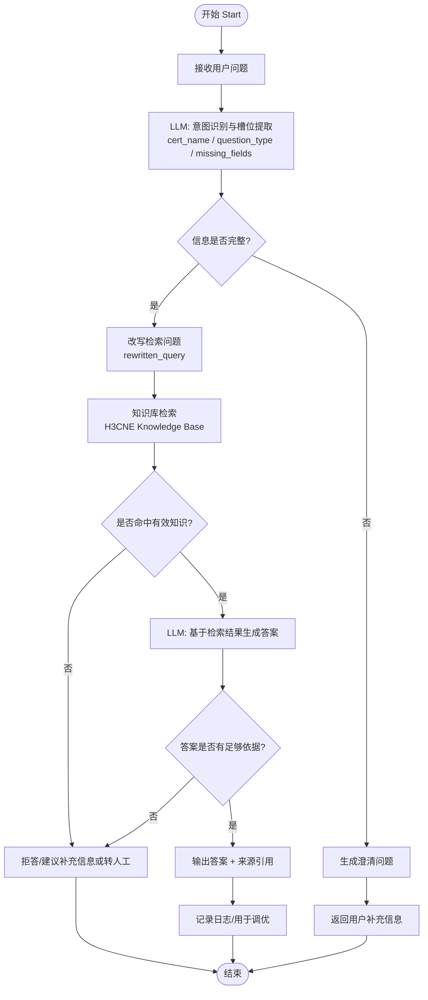

# H3CNE MVP Chatflow 拓扑图

## 1. 目标

本图用于描述 **H3CNE AI 客服 MVP** 在 Dify 中的最小可用 `Chatflow` 拓扑结构。

本次设计目标：

- 先跑通最小闭环
- 支持 H3CNE 资料问答
- 支持必要澄清
- 支持基于知识库回答
- 支持无依据时拒答

---

## 2. Chatflow 拓扑图



---

## 3. 拓扑图说明

## 3.1 主链路

MVP 主链路如下：

```text
用户提问
→ 提取认证项目与问题类型
→ 判断是否缺信息
→ 信息足够则检索知识库
→ 基于检索内容生成回答
→ 带来源返回
```

## 3.2 两个关键分支

### 分支一：澄清分支
当用户问题过于模糊时，先不检索，直接澄清。

适用示例：

- 我适合考哪个 H3C 证？
- 这个证我能报吗？
- 这个怎么报名？

### 分支二：拒答分支
当知识库没有命中、或命中不足以支持结论时，不强答。

适用示例：

- 你保证我一次通过吗？
- 你帮我预测会出哪些题？
- 当前资料里无法确认考试代码/有效期

---

## 4. 节点级拓扑说明

| 节点 | 类型 | 作用 | 输入 | 输出 |
| --- | --- | --- | --- | --- |
| Start | 开始节点 | 接收用户会话 | 用户输入 | 原始问题 |
| 意图识别与槽位提取 | LLM 节点 | 提取认证项目、问题类型、缺失字段 | 原始问题 + 历史上下文 | 结构化字段 |
| 信息是否完整 | IF/ELSE | 判断是否要先澄清 | 槽位提取结果 | 是/否 |
| 生成澄清问题 | Answer/LLM | 向用户追问缺失信息 | missing_fields | 澄清问题 |
| 改写检索问题 | LLM/Template | 生成标准化查询 | 原始问题 + 槽位 | rewritten_query |
| 知识库检索 | Knowledge Retrieval | 检索 H3CNE 资料 | rewritten_query | topK 片段 |
| 是否命中有效知识 | IF/ELSE | 判断检索是否足够有效 | 检索结果 | 是/否 |
| 基于检索生成答案 | LLM 节点 | 严格依据知识片段回答 | 检索结果 + 用户问题 | answer |
| 答案是否有足够依据 | IF/ELSE | 控制幻觉 | answer + 检索结果 | 是/否 |
| 输出答案 + 来源引用 | Answer | 返回最终答案 | answer + citation | 用户可见回复 |
| 拒答/建议补充信息 | Answer | 没依据时保守回复 | 原始问题 + 缺口 | 拒答回复 |
| 记录日志/用于调优 | 日志 | 留存问答记录 | 全链路变量 | 调优数据 |

---

## 5. 推荐 Dify 节点顺序

若 B 在 Dify 中按最小工作流搭建，推荐顺序如下：

1. `Start`
2. `LLM - 槽位提取`
3. `IF - need_clarify?`
4. `Answer - 澄清问题`
5. `Knowledge Retrieval`
6. `LLM - 回答生成`
7. `IF - answer_supported?`
8. `Answer - 正常回答`
9. `Answer - 拒答`

如果想更规范一点，可以在检索前增加一个：

10. `Template/LLM - rewritten_query`

---

## 6. 极简版拓扑图

如果只是给团队快速沟通，可直接看下面这版：

```text
开始
  ↓
用户提问
  ↓
识别：是不是 H3CNE？问的是啥？
  ↓
信息不够？
  ├─ 是 → 追问澄清 → 结束
  └─ 否 → 检索知识库
              ↓
          检索不到？
          ├─ 是 → 拒答/建议补充
          └─ 否 → 生成答案 + 来源
```

---

## 7. MVP 推荐节点输入输出变量

建议最少保留这些变量：

| 变量名 | 含义 |
| --- | --- |
| `query` | 用户原始问题 |
| `cert_name` | 认证名称，如 H3CNE |
| `question_type` | 问题类型 |
| `missing_fields` | 缺失信息 |
| `need_clarify` | 是否需要澄清 |
| `rewritten_query` | 检索改写问题 |
| `retrieval_result` | 检索命中内容 |
| `answer_supported` | 是否有足够依据 |
| `final_answer` | 最终回复 |

---

## 8. 本次 MVP 建议重点

本次不要把 Chatflow 做复杂，优先保住这 3 件事：

1. **问题能分类**
2. **知识能检索到**
3. **答不准时能拒答**

一句话：

> 当前 H3CNE MVP 的 Chatflow 拓扑应以“最小节点数 + 最稳回答链路”为原则，不追求复杂编排，优先保证可运行与可调试。

