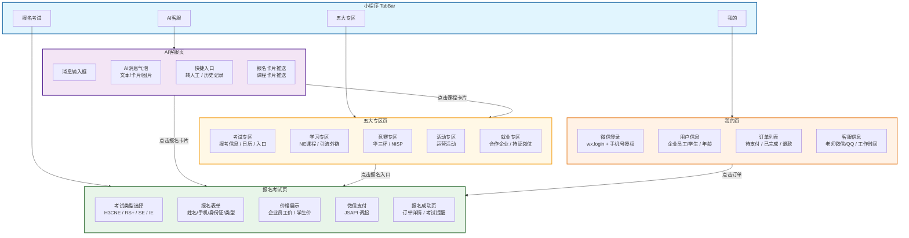
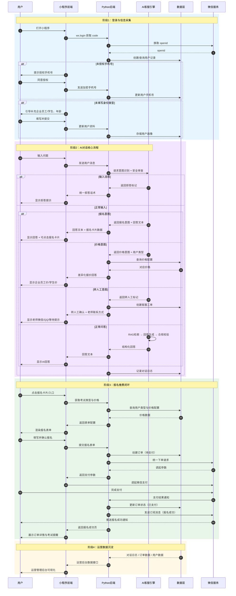
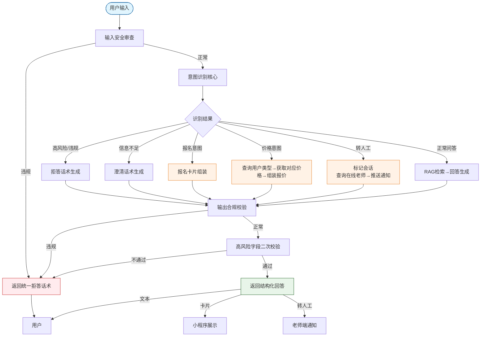
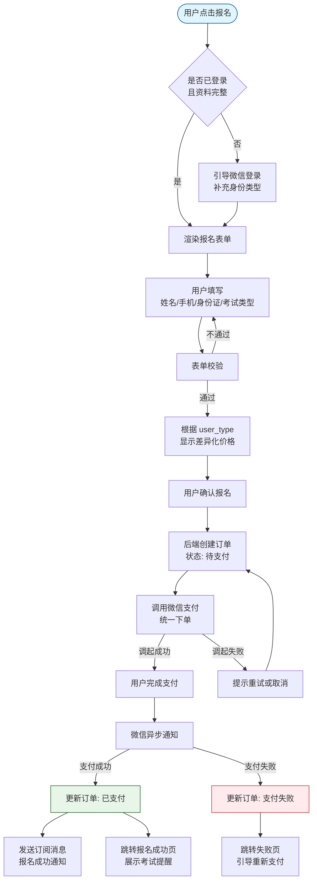
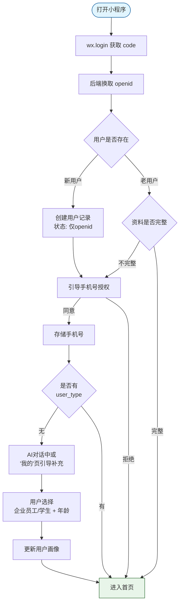
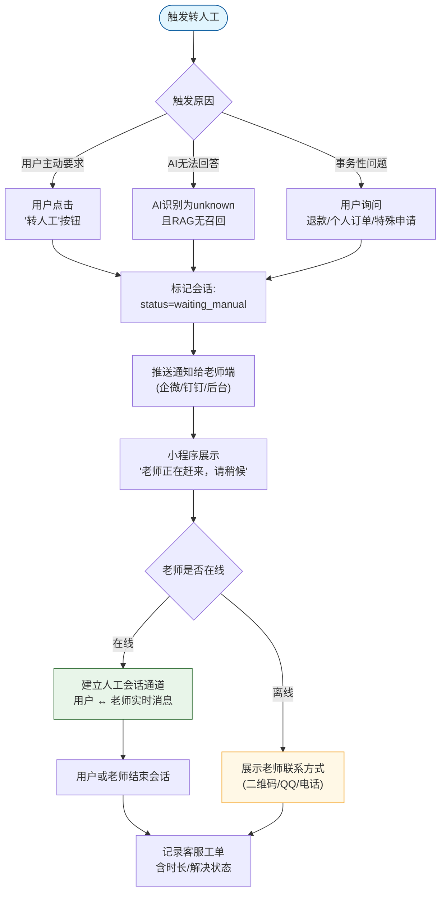
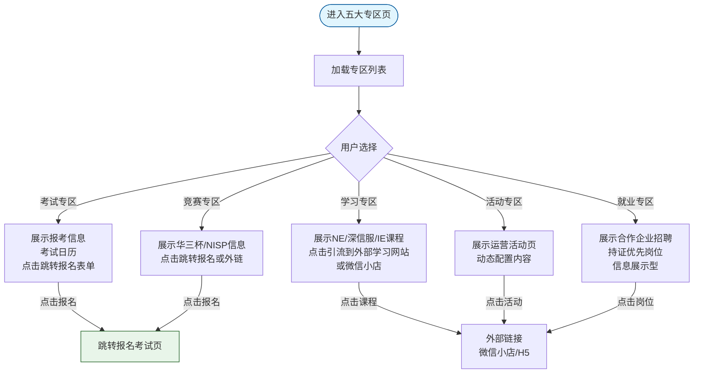
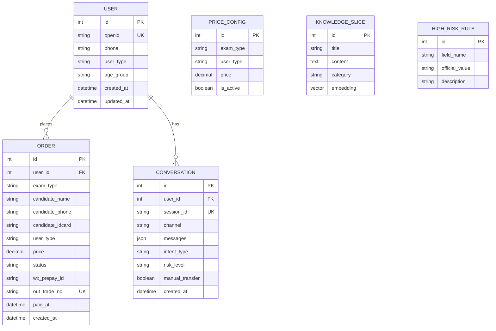
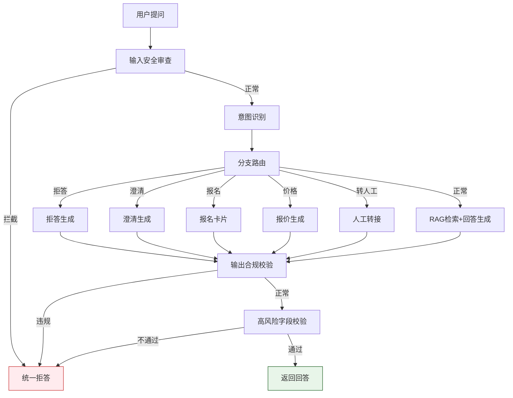

# H3C认证智能客服 —— 小程序架构图

---

## 1. 小程序前端模块架构

---

## 2. 端到端业务流程图

---

## 3. 核心模块详细逻辑

### 3.1 AI客服模块逻辑

**关键逻辑说明：**

| 节点 | 逻辑说明 |
|------|----------|
| 输入安全审查 | 敏感词过滤、Prompt注入检测、违规内容拦截 |
| 意图识别 | 复用 `h3cne_intent_recognizer.py`，输出字段扩展：`intent_type`（qa / register / price / transfer / unknown）、`risk_level`、`clarify_needed`、`retrieval_query` |
| 报名卡片组装 | 当 `intent_type=register` 时，后端组装包含 `exam_type`、`price`、`form_url` 的卡片JSON，小程序前端渲染为可点击卡片 |
| 差异化报价 | 当 `intent_type=price` 时，根据 `user.user_type`（enterprise/student）查询 `price_config` 表，返回对应价格；未登录用户先引导登录/补充资料 |
| 转人工触发条件 | ① `intent_type=transfer`；② 连续2轮输入"转人工""找老师"；③ `intent_type=unknown` 且 RAG 无召回结果 |
| 输出双校验 | 第一层：内容合规（政治/色情/暴力/违规承诺）；第二层：高风险字段与官方口径库比对（考试代码/有效期/重认证规则） |

---

### 3.2 报名缴费模块逻辑

**关键逻辑说明：**

| 节点 | 逻辑说明 |
|------|----------|
| 资料完整性校验 | 必须包含：openid、phone、user_type（enterprise/student）。缺任一字段则引导补充 |
| 报名表单字段 | 考试类型（单选）、姓名、手机号（默认带出）、身份证号（考试用）、用户类型（默认带出，可修改） |
| 价格差异化 | 从 `price_config` 表读取：`exam_type + user_type → price`。企业员工可申请考试券（批量报名时走审批流） |
| 订单状态机 | 待支付 → 已支付 / 支付失败 / 已取消 → 已完成 / 已退款 |
| 支付回调幂等 | 微信通知可能多次到达，后端以 `out_trade_no` 做幂等处理，已处理过的通知直接返回成功 |
| 订阅消息 | 支付成功后调用 `subscribeMessage.send`，推送报名成功 + 考试提醒（需用户此前授权订阅消息） |

---

### 3.3 用户与信息采集模块逻辑

**关键逻辑说明：**

| 节点 | 逻辑说明 |
|------|----------|
| 静默登录 | 每次打开小程序先执行 `wx.login`，后端用 code 换 openid，实现无感知登录 |
| 手机号授权 | 必须触发 `getPhoneNumber` 组件，用户同意后才能获取加密手机号，后端解密存储 |
| 身份类型采集时机 | ① 首次登录后强引导；② AI 对话中识别到价格/报名意图时，若发现未采集则主动追问；③ "我的"页面随时可修改 |
| 用户画像字段 | `openid`（必须）、`phone`（必须）、`user_type`（enterprise/student，必须）、`age_group`（under_18/18_25/25_35/above_35，可选） |

---

### 3.4 人工客服模块逻辑

**关键逻辑说明：**

| 节点 | 逻辑说明 |
|------|----------|
| 主动转人工 | 小程序对话页常驻"转人工"按钮，用户点击后直接触发 |
| AI无法回答 | 意图识别返回 `unknown` 且 RAG 知识库无召回结果时，自动提示"是否转人工" |
| 事务性问题 | 检测到关键词：退款、取消订单、我的报名、考试改期、发票等，直接触发转人工 |
| 老师端形态 | Phase 1：在企业微信/钉钉群中接收通知，手动添加用户微信；Phase 2：简易 Web 客服后台，可在线收发消息 |
| 会话状态 | `waiting_manual` → `in_manual_chat` → `resolved` / `unresolved` |

---

### 3.5 五大专区模块逻辑

**关键逻辑说明：**

| 专区 | 内容来源 | 交互方式 | 前期实现方式 |
|------|----------|----------|--------------|
| 考试专区 | `docs/H3CNE/清洗数据/` 中的报考信息 | 跳转报名表单 | 静态内容 + 报名入口 |
| 学习专区 | NE/深信服/IE/培训内容 | 引流到外部学习网站 / 微信小店 | 静态内容 + 外链 |
| 竞赛专区 | 华三杯、NISP 报名信息 | 跳转报名或外链 | 静态内容 + 外链 |
| 活动专区 | 运营活动页 | 动态配置 | CMS 配置或 JSON 静态配置 |
| 就业专区 | 合作企业招聘信息 | 信息展示 | 静态内容 |

---

## 4. 数据层设计

---

## 5. AI 客服引擎内部流程（简版）

---

## 6. 与已有资产的衔接

| 已有资产 | 如何复用 | 衔接点 |
|----------|----------|--------|
| `h3cne_intent_recognizer.py` | Python 后端部署为意图识别服务 API | 小程序请求先过此模块，输出扩展字段：报名/价格/转人工意图 |
| Dify Workflow + RAG 知识库 | 后端转发用户问题到 Dify，返回结果给小程序 | 正常问答分支走 Dify，报名/价格类问题在 Dify 中新增分支节点 |
| `dify_spider.py` 测试体系 | 持续回归使用 | 每次知识库更新后跑一遍测试集，确保小程序 AI 回答质量 |
| `docs/H3CNE/清洗数据/` | 直接作为 RAG 知识库源 | 同时部分内容（如报名方式）同步到"考试专区"展示 |
| Ollama 本地模型 | 替换公网 API，提供本地推理 | 后端配置 Ollama 地址，Dify 工作流调用本地模型 |

---

## 7. 模块复用与新增汇总

| 模块类型 | 模块名称 | 复用情况 | 核心职责 |
|----------|----------|----------|----------|
| :blue_circle: 现有资产 | 意图识别模块 | 100%复用现有 Python 代码 | 识别认证名称、问题类型、风险等级，扩展报名/价格/转人工意图 |
| :blue_circle: 现有资产 | RAG 检索引擎 | 100%复用现有 Dify 检索配置 | 基于检索 query 匹配召回知识库片段 |
| :blue_circle: 现有资产 | H3CNE 切片知识库 | 100%复用已清洗的切片数据 | 官方认证资料、FAQ、高风险字段口径 |
| :yellow_circle: 新增模块 | 微信小程序前端 | 新增 | AI 对话页、报名缴费、五大专区、我的、微信登录授权 |
| :yellow_circle: 新增模块 | 报名缴费模块 | 新增 | 报名表单、微信支付、订单管理、报名成功通知 |
| :yellow_circle: 新增模块 | 人工客服转接模块 | 新增 | AI 无法回答时标记会话并推送至老师端 |
| :yellow_circle: 新增模块 | 输入安全审查模块 | 新增 | 前置拦截敏感内容、恶意 prompt 注入、违规提问 |
| :yellow_circle: 新增模块 | 输出合规校验模块 | 新增 | 后置校验模型输出内容，过滤违规回答 |
| :yellow_circle: 新增模块 | 高风险字段二次校验 | 新增 | 对考试代码、有效期、重认证规则等高风险内容做最终口径校验 |
| :purple_circle: 模型服务 | Ollama 本地大模型服务 | 新增替换公网 API | 提供本地化大语言模型推理和向量嵌入能力 |
