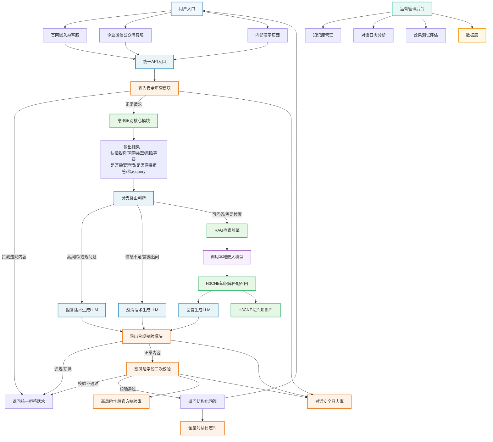

# H3C认证智能客服 业务流程图

---

## 业务流程执行逻辑（按实际调用顺序）
1. **用户提问**：用户通过官网、公众号、内部页等渠道发起提问
2. **输入安全校验**：先过滤敏感词、恶意prompt、违规提问，拦截直接返回拒答话术
3. **意图识别**：调用现有Python意图识别代码，输出认证名称、问题类型、风险等级、处理模式
4. **分支路由**：根据意图识别结果走三个分支：
   - ✋ **拒答分支**：高风险/违规问题直接生成标准拒答话术
   - ❓ **澄清分支**：信息不足时生成追问话术，引导用户补充信息
   - ✅ **正常回答分支**：走RAG检索流程，调用本地嵌入模型查询知识库，召回相关知识片段后生成回答
5. **输出双校验**：
   - 先做内容合规校验，过滤政治敏感、色情暴力、违规承诺内容
   - 再做高风险字段二次校验，和官方口径比对，不一致直接拒答，从根源杜绝幻觉
6. **返回回答**：校验通过后返回结构化答复给用户，同时记录完整对话日志
7. **运营管理**：运营人员可通过后台管理知识库、分析对话日志、做效果测试评估

---

## 模块说明
| 模块类型 | 模块名称 | 复用情况 | 核心职责 |
|----------|----------|----------|----------|
| 🔵 现有资产 | 意图识别模块 | 100%复用现有Python代码 | 识别认证名称、问题类型、风险等级，判断处理模式 |
| 🔵 现有资产 | RAG检索引擎 | 100%复用现有Dify检索配置 | 基于意图识别输出的检索query，匹配召回知识库相关片段 |
| 🔵 现有资产 | H3CNE切片知识库 | 100%复用已清洗的切片数据 | 存储官方认证资料、FAQ、高风险字段口径 |
| 🟡 新增模块 | 输入安全审查模块 | 新增 | 前置拦截敏感内容、恶意prompt注入、违规提问 |
| 🟡 新增模块 | 输出合规校验模块 | 新增 | 后置校验模型输出内容，过滤违规回答 |
| 🟡 新增模块 | 高风险字段二次校验 | 新增 | 对考试代码、有效期、重认证规则等高风险内容做最终口径校验 |
| 🟣 模型服务 | Ollama本地大模型服务 | 新增替换公网API | 提供本地化大语言模型推理和向量嵌入能力 |
